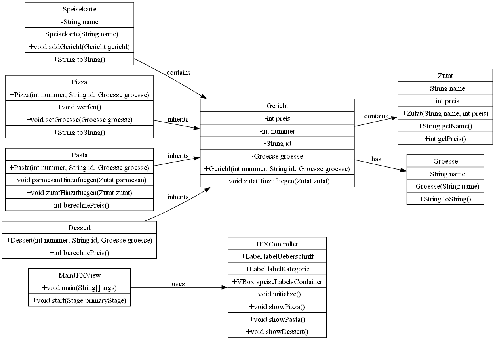
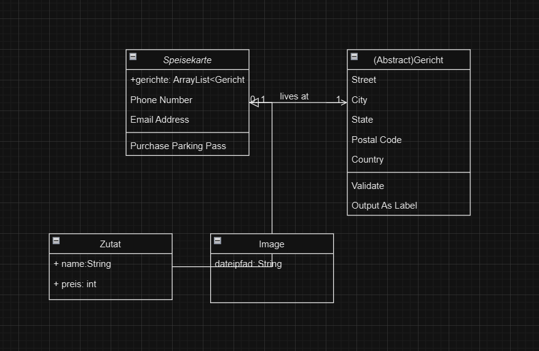
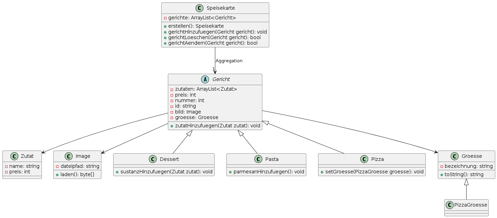

# LAROMA Arc42-Dokument für die Pizzeria-Software

## 1. Einleitung und Ziele
Diese Dokumentation beschreibt die Architektur der Pizzeria-Software. Ziel ist es, eine benutzerfreundliche und effiziente Speisekartenverwaltung zu ermöglichen, die skalierbar, wartbar und erweiterbar ist. Die Software soll in der Lage sein, die Speisekarte der Pizzeria einfach zu verwalten und den Kunden übersichtlich zu präsentieren.

## 2. Ziele und Vision
Manuel Fuioso möchte sein erstes Geschäft in Brandenburg an der Havel aufbauen. Er hat bereits einen Laden in der Innenstadt angemietet und möchte seine Arbeit möglichst mit digitalen Werkzeugen unterstützen. Manuel plant, weitere Geschäfte in Brandenburg und Umgebung zu eröffnen, weshalb die Software leicht zu bedienen und an zukünftige Wünsche anpassbar sein soll. Jeder weitere Laden wird von einem Manager verwaltet, der die Software nutzt.

### 2.1 Kurzfristige Ziele
- Installation der Software auf einem Rechner im Laden
- Verwaltung der Speisekarte mit Optionen für Pizza, Pasta, Dessert und Getränke

### 2.2 Langfristige Ziele
- Webbasierte Bedienbarkeit der Software
- Unterstützung durch IT-Administratoren bei Problemen
- Einsatz auf verschiedenen Betriebssystemen (Windows, Apple)

## 3. Aufgabenstellung
Manuel Fuioso benötigt eine Software zur Verwaltung seiner Speisekarte, die folgende Funktionen unterstützt:
- **Gerichte verwalten:**
  - Kategorien: Pizza, Pasta, Dessert und Getränke
  - Angaben für jedes Gericht: Größe, Name, Preis, Zutaten, Bild (optional)
- **Speisekartenfunktionen:**
  - Export und Import der Speisekarte für andere Geschäfte
  - HTML-Export der Speisekarte
  - Möglichkeit, Gerichte zu löschen oder zu deaktivieren

## 4. Qualitätsziele
- **Benutzerfreundlichkeit:** Die Software muss intuitiv bedienbar sein, damit auch Manager ohne technische Vorkenntnisse sie effizient nutzen können.
- **Skalierbarkeit:** Die Software muss leicht an die Anforderungen weiterer Geschäfte angepasst werden können.
- **Plattformunabhängigkeit:** Die Anwendung soll auf verschiedenen Betriebssystemen (Windows, Apple) installiert werden können.
- **Wartbarkeit:** Ein IT-Administrator muss die Software leicht prüfen und bei Bedarf wieder in Betrieb nehmen können.

## 5. Stakeholder-Map
- **Manuel Fuioso:** Auftraggeber, Hauptnutzer der Software
- **Manager der Pizzeria:** Nutzer, verantwortlich für die Verwaltung der Speisekarte
- **Kunden der Pizzeria:** Endnutzer, die die Speisekarte einsehen
- **IT-Administrator:** Technischer Support, verantwortlich für die Wartung der Software
- **Entwicklungsteam:** Software-Entwicklung und -Wartung

## 6. Randbedingungen
### 6.1 Technische Randbedingungen
- Die Anwendung wird als JavaFX-Anwendung entwickelt und läuft auf Desktop-Computern.
- Die Anwendung muss sowohl auf Windows als auch auf Apple-Betriebssystemen laufen.

### 6.2 Geschäftliche Randbedingungen
- Manuel Fuioso plant, die Software in mehreren Geschäften einzusetzen.
- Die Software muss flexibel und anpassbar sein, um zukünftige Erweiterungen zu unterstützen.

## 7. Lösungskonzept
### 7.1 Architekturmuster
Die Software verwendet eine Schichtenarchitektur, die das System in separate Schichten für Präsentation und Geschäftslogik unterteilt. Dies ermöglicht eine klare Trennung der Verantwortlichkeiten und erleichtert die Wartung und Erweiterung des Systems.

### 7.2 Haupt-Bausteine
- **Frontend:**
  - Entwickelt mit JavaFX, verantwortlich für die Benutzeroberfläche und die Client-seitige Logik.
  - Darstellung der Speisekarte und Interaktion mit dem Backend über Methodenaufrufe.
- **Backend:**
  - Implementiert in Java, stellt die Geschäftslogik bereit und verwaltet die Speisekartendaten.
  - Unterstützt Funktionen wie Hinzufügen, Ändern und Löschen von Gerichten sowie Export und Import der Speisekarte.
- **Dateisystem:**
  - Speichert die Daten in lokalen Dateien anstelle einer Datenbank.
  - JSON- oder XML-Dateien können zur Speicherung der Speisekartendaten verwendet werden.

### 7.3 UML-Darstellung

## 8. Bausteinsicht
### 8.1 Ebene 1: Gesamtsystem
Das System besteht aus dem Frontend, Backend und dem Dateisystem.

### 8.2 Ebene 2: Subsysteme
- **Frontend:**
  - Benutzeroberfläche und Client-seitige Logik.
  - Kommunikation mit dem Backend.
- **Backend:**
  - Geschäftslogikkomponenten.
  - Verarbeitung von Anfragen und Interaktion mit dem Dateisystem.
- **Dateisystem:**
  - Speicherung und Verwaltung der Speisekartendaten in JSON- oder XML-Dateien.

## 9. Laufzeitsicht
### 9.1 Szenario 1: Benutzeranfrage
- Ein Benutzer öffnet die Anwendung, und die Speisekarte wird angezeigt.
- Das Backend ruft die Speisekartendaten aus den lokalen Dateien ab und sendet sie an das Frontend, das die Daten darstellt.

### 9.2 Szenario 2: Speise hinzufügen
- Der Benutzer fügt eine neue Speise über die Eingabemaske hinzu.
- Diese wird an das Backend gesendet, das die Daten speichert und die aktualisierte Speisekarte an das Frontend zurücksendet.

## 10. Verteilungssicht
### 10.1 Server-Setup
Die Anwendung wird lokal auf den Rechnern der Pizzeria installiert und betrieben.

### 10.2 Netzwerk
Da die Anwendung lokal läuft, erfolgt keine Netzwerkkommunikation zwischen Frontend und Backend. Alle Komponenten laufen auf demselben Rechner und kommunizieren direkt miteinander.

## 11. Betrieb und Wiederherstellung
### 11.1 Ansprechpartner und Service Level
Definieren von Verantwortlichkeiten und Eskalationspfaden für technische Probleme.

### 11.2 Installation und Konfiguration
- **Manuelle Installation:** Schritt-für-Schritt-Anleitung zur Installation der Software.
- **Installation mit Ansible:** Automatisierte Installationsskripte zur schnellen Einrichtung der Software.
- **Umgebung aufsetzen:** Anleitung zur Einrichtung der Entwicklungs-, Test- und Produktionsumgebungen.

## 12. Entwurfsentscheidungen
### 12.1 Technologie-Entscheidungen
- **Programmiersprache:** Verwendung von Java und JavaFX aufgrund der guten Integration und der umfangreichen Bibliotheken für die Entwicklung von Desktop-Anwendungen.
- **Datenhaltung:** Verwendung von JSON- oder XML-Dateien zur Speicherung der Speisekartendaten anstelle einer Datenbank.

## 13. Qualitätsszenarien
- **Sicherheit:** Die Authentifizierung erfolgt über JWT (JSON Web Token).

## 14. Risiken und technische Schulden
- **Performanz:** Wenn die Anwendung auf einem älteren Rechner läuft, könnte die Performanz beeinträchtigt werden. Regelmäßige Tests und Optimierungen sind erforderlich.
- **Sicherheit:** Da die Anwendung lokal läuft, müssen keine speziellen Sicherheitsmaßnahmen für die Netzwerkkommunikation getroffen werden. Dennoch ist es wichtig, die Daten sicher zu speichern und Zugriffe zu kontrollieren.

## 15. Projektbeteiligte
- **Projektleiter:** Eiad Abdulmomenaljazairli
- **Software-Architekt:** Loran Solaiman
- **Entwickler:** Mohammad Al Saadi
- **Frontend-Entwickler:** Ola Abdulhafiz
- **Tester:** Mohammed Yazan Ajjawi, Mahmoud Arbash

## 16. Glossar
- **JavaFX:** Ein Framework für die Entwicklung von Desktop-Anwendungen in Java.
- **JSON (JavaScript Object Notation):** Ein Format zur Speicherung und zum Austausch von Daten, das leicht lesbar und beschreibbar ist.
- **XML (eXtensible Markup Language):** Ein Format zur Speicherung und zum Austausch von Daten, das durch seine Struktur und Flexibilität gekennzeichnet ist.

## 17. Projektdauer
Das Projekt wurde vom 19.03.2024 bis zum 25.06.2024 durchgeführt.
